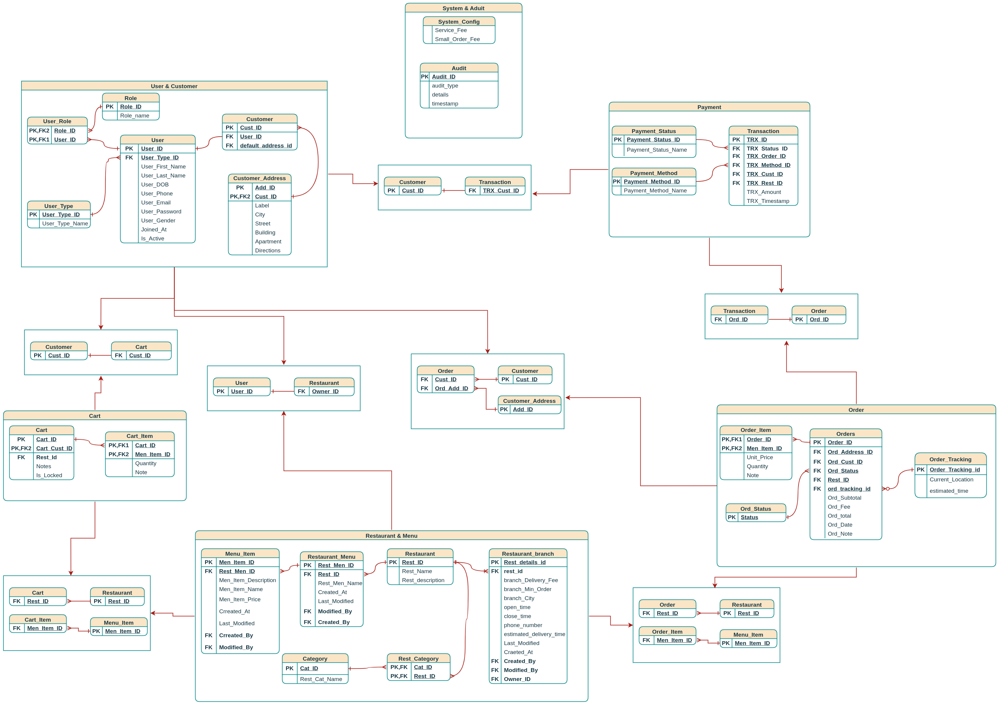
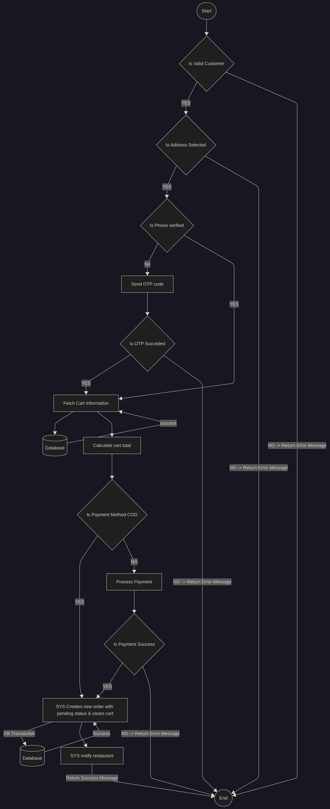

# Food Delivery: Analysis


## Executive Summary (Vision)

Food Delivery is a Talabat-like restaurant browsing and ordering system designed to simplify the process of discovering restaurants,
exploring menus, and placing orders.

The system provides customers with an intuitive platform to browse a wide variety of restaurants,
manage their orders efficiently, and enhance their overall ordering experience. Additionally,
the platform aims to help restaurants expand their customer base by increasing visibility and accessibility to new customers.

## Document Scope

This document focuses on system analysis and high-level design.
Implementation details are intentionally excluded.
Implementation details will be maintained in a separate repository.

## System Requirements

<details>
<summary>System Features and & API Endpoints</summary>

### System Features and & API Endpoints

#### F01-Restaurant Browsing

##### Functions

- View all restaurants
- view all categories / restarant categories
- View restaurant menu
- View restaurant reviews
- View item reviews
- View recommended restaurants
- View top rated restaurants
- View top rated items
- Search restaurants (Filters)
- Search menu items (Filters)

#### F02-User Registration & Authentication

##### Functions

- Sign up
- Forget Password
- Email verfication
- OTP verfication
- User / Customer profile
- Logout

#### F03-Cart Management

##### Functions

- Add to cart
- Remove cart item
- View cart
- Clear cart
- Update item quantity

#### F04-Order Management

##### Functions

- Cancel Order by (Customer / Resturant)
- Track order status (customer)
- Update Order status (Restaurant)
- Place Order

> **Note**: Order statuses after checkout are: **Pinding**, **In Progress**, **On the way**, **Delivered**.

##### Constraints

- Customer can't modify or delete items after **Pending** status.
- Customer can't cancel order after **Pending** status.
- Only authenticated customers can place orders.
- Customer should be notified on order placement, status updated
- Customer must only be able to place order if he
  - Entered or selected detailed delivery address
  - Selected payment method
    - if the method is not cash on delivery then the payment should be confirmed first
  - Entered or selected his phone number

#### F05-Customer Profile Management

##### Functions

- Update profile information
- Prefered Payment method
- Address management (Multiple addresses)
  - Add address
  - Update address
  - Delete address
- Deactivate account
- Rate order (Restaurant / Item)
- View order history
- Change password
- Change email address
- Enable or Disable account

##### Constraints

- Customer should provide his old password in order to change the password
- Customer should provide his password in order disable his account

#### F06-Payment Integration

##### Functions

- Payment integration with 3rd party
- Multiple payment methods
- View payment transactions

#### F07-Restaurant & Menu & Categories Management

##### Functions

- Add restarant
- Update restaurant
- Enable / Disable
- Add restaurant category
- Update restaurant category
- Delete restaurant category
- Add restaurant menu
- Update menu
- Delete menu
- Add menu category
- Update menu category
- Delete menu category
- View menu history
- Search for restaurant, restaurant category, menu, menu category

#### F08-Restaurant Dashboard

##### Functions

- Daily order count
- Daily delivered order count
- Daily undelivered order count
- Total order count
- Daily cancelled order count
- Total cancelled order count
- Daily amount of transactions
- Total amount of transactions
- Daily transaction report
- Monthly transaction report

#### F09-System Admin Dashboard

##### Functions

- Count restaurants
- Count customers
- count active customers
- Daily order count
- Total order count
- Daily cancelled order count
- Total cancelled orders
- Daily amount of transactions
- Total amount of transactions
- Daily transaction report
- Monthly transaction report

---

---

</details>

## Data Model

> The data layer will be designed with a focus on: **Data Integrity**, **Data Consistency**, **Normalization**, **Denormalization**, **Indexing**, **Performance Tuning**.

### Initial DB - Schema

<div align=center>



</div>

## Diagrams & Charts

### Place Order

<details>
<summary>Place Order Use Case</summary>

#### Use Case

- Actor: Customer
- **Description**: Validates cart, payment, and profile data to create a formal order.
- **Preconditions**: Cart is not empty. User is logged in.
- **Main Flow**:
  - User clicks "Checkout."
  - System validates User Profile:
  - Check: Is DeliveryAddress selected?
  - Check: Is PhoneNumber verified?
  - System locks the Cart (prevents modification).
  - System calculates Final Total (Cart Total + Delivery Fee + Tax).
  - User selects Payment Method (e.g., Credit Card).

  - **Process Payment**: System communicates with Payment Gateway & receives "Success" token.
  - System creates Order record with Status = Pending.
  - System creates OrderItem records for each item in the cart.
  - System clears the User's Cart.
    - System sends notification to the Restaurant.

- **Alternative Flows**:
  - **Payment Failed**.
    - Gateway returns "Declined."
    - System returns error message indicating the transaction is declined.

  - **Missing Address**.
    - System returns error message indecating the address is missing.
  - **Phone Is Not Verified**
    - System returns error message indicating the phone is not verified.

- **Constraints**:
  - User cannot place an order if the Restaurant is Closed.
  - Minimum Order Value (if defined by restaurant) must be met or small order fee is applied.

#### Flowchart

<div align=center>



</div>

#### Sequence Diagram

<div align=center>


</div>

#### Pseudocode

```text
placeOrder(request){
  if(!isValidCustomer)
    return 'Invalid customer. Please login before creating new Order'

  if(!isAddressSelected)
    return 'Please select address'

  if(!isPhoneVerified)
    if(!verifyPhoneWithOTP)
      return 'Invalid phone number. Please enter valid one'

  cartInfo= fetchCartInfo
  total=calcOrderTotal

  if(!isPaymentCOD)
    if(!processPayment)
      return 'Payment Declined'

  saveOrder // DB Transaction creates order record with pending status
  @async notifyRest

  return 'Order placed successfully'

}
```

</details>

## Technology Stack (Planned)

- **Backend:** Java, Spring, Git.
- **Database:** PostgreSQL
- **Modeling Tools:** Various modeling tools.
- **Documentation:** Markdown.

---

## Contact & Contribution

- **Author:** Abdalla Samir Khalifa
- **Role:** Systems Analyst & Backend Developer
- **Contact**:
  - GitHub: [@AbdallaSamirKhalifa](https://github.com/AbdallaSamirKhalifa)
  - Email: [abdallasamirkhalifa@gmail.com](abdallasamirkhalifa@gmail.com)
  - Linkedin: [Abdalla Khalifa](https://linkedin.com/in/abdalla-khalifa)
